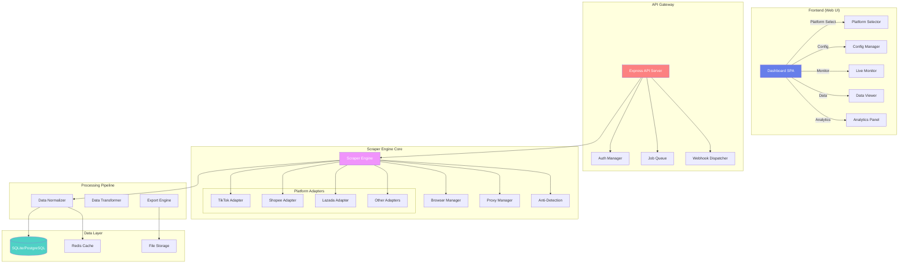
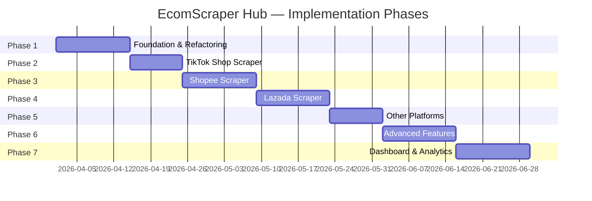
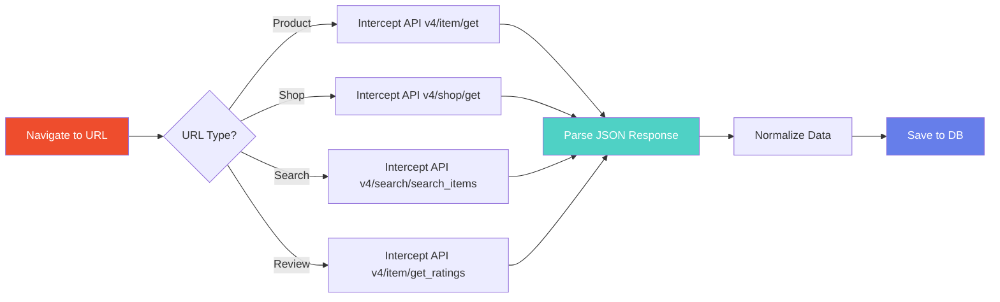
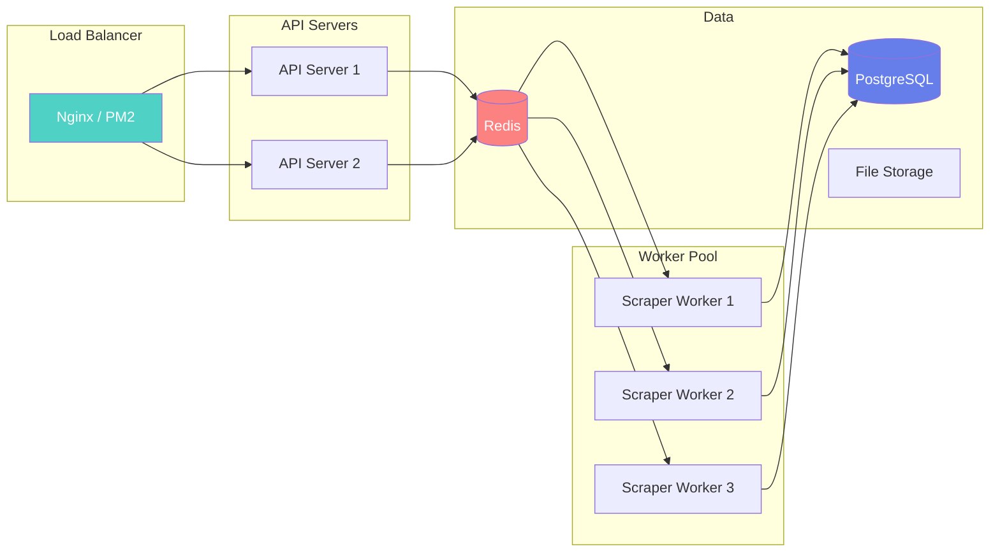

# 🛒 EcomScraper Hub — Multi-Platform E-Commerce Scraper System

> **Goal**: Transform the existing TikTok Live Scraper into a modular, scalable, multi-platform e-commerce data scraping system that supports TikTok Shop, Shopee, Lazada, and other platforms.

---

## 📋 Table of Contents

1. [Current State Analysis](#current-state-analysis)
2. [Target Architecture](#target-architecture)
3. [Project Structure](#project-structure)
4. [Phase Overview](#phase-overview)
5. [Phase 1: Foundation & Refactoring](#phase-1-foundation--refactoring)
6. [Phase 2: TikTok Shop Scraper](#phase-2-tiktok-shop-scraper)
7. [Phase 3: Shopee Scraper](#phase-3-shopee-scraper)
8. [Phase 4: Lazada Scraper](#phase-4-lazada-scraper)
9. [Phase 5: Other Platforms](#phase-5-other-platforms)
10. [Phase 6: Advanced Features](#phase-6-advanced-features)
11. [Phase 7: Dashboard & Analytics](#phase-7-dashboard--analytics)
12. [Data Schema Design](#data-schema-design)
13. [API Design](#api-design)
14. [Security & Anti-Detection](#security--anti-detection)
15. [Deployment & Scaling](#deployment--scaling)

---

## Current State Analysis

The existing project is a **TikTok Live comment scraper** with these capabilities:

| Component | Description |
|-----------|-------------|
| `server.js` (1418 lines) | Monolithic Express server — handles API, scraper processes, webhooks, AI reply |
| `scripts/scraper_wrapper.js` | Playwright-based browser automation for TikTok Live |
| `scripts/ai-webhook-server.js` | AI-powered auto-reply system with Mock Rules engine |
| `public/` | Web UI with 16 component JS files (ConfigForm, CommentList, etc.) |
| `data/` | JSON file storage (comments, mock_rules) |
| Auth | Chrome profile, StorageState, cookies import |
| Webhooks | Discord, Slack, Telegram, Custom |

### Current Limitations

- ⚠️ Monolithic architecture — everything in one `server.js`
- ⚠️ TikTok-only — no abstraction for other platforms
- ⚠️ JSON file storage — not scalable for large datasets
- ⚠️ No scheduling/queue system
- ⚠️ No proxy rotation or anti-detection beyond basic stealth
- ⚠️ No data normalization across platforms

---

## Target Architecture



---

## Project Structure

```
ecom-scraper-hub/
├── package.json
├── .env
├── .env.example
├── server.js                          # Express API entry point (lean)
│
├── src/
│   ├── core/
│   │   ├── ScraperEngine.js           # Main orchestrator
│   │   ├── BrowserManager.js          # Playwright/Puppeteer lifecycle
│   │   ├── ProxyManager.js            # Proxy rotation & health check
│   │   ├── AntiDetection.js           # Stealth, fingerprinting, CAPTCHA
│   │   ├── RateLimiter.js             # Per-platform rate limiting
│   │   ├── RetryStrategy.js           # Exponential backoff, circuit breaker
│   │   └── EventBus.js               # Internal event system
│   │
│   ├── platforms/
│   │   ├── BasePlatformAdapter.js     # Abstract base class
│   │   ├── tiktok/
│   │   │   ├── TikTokAdapter.js       # Platform adapter implementation
│   │   │   ├── TikTokLiveScraper.js   # Live comment scraping
│   │   │   ├── TikTokShopScraper.js   # Product/shop data scraping
│   │   │   ├── TikTokAuth.js          # TikTok-specific auth
│   │   │   ├── selectors.js           # DOM selectors registry
│   │   │   └── config.js              # Platform-specific config
│   │   ├── shopee/
│   │   │   ├── ShopeeAdapter.js
│   │   │   ├── ShopeeProductScraper.js
│   │   │   ├── ShopeeShopScraper.js
│   │   │   ├── ShopeeSearchScraper.js
│   │   │   ├── ShopeeReviewScraper.js
│   │   │   ├── ShopeeFlashSaleScraper.js
│   │   │   ├── ShopeeAuth.js
│   │   │   ├── ShopeeAPI.js            # Shopee internal API client
│   │   │   ├── selectors.js
│   │   │   └── config.js
│   │   ├── lazada/
│   │   │   ├── LazadaAdapter.js
│   │   │   ├── LazadaProductScraper.js
│   │   │   ├── LazadaShopScraper.js
│   │   │   ├── LazadaSearchScraper.js
│   │   │   ├── LazadaReviewScraper.js
│   │   │   ├── LazadaAuth.js
│   │   │   ├── LazadaAPI.js
│   │   │   ├── selectors.js
│   │   │   └── config.js
│   │   └── others/
│   │       ├── AmazonAdapter.js        # Future: Amazon
│   │       ├── AliExpressAdapter.js     # Future: AliExpress
│   │       ├── JDCentralAdapter.js      # Future: JD Central (TH)
│   │       └── NocNocAdapter.js         # Future: NocNoc (TH)
│   │
│   ├── api/
│   │   ├── routes/
│   │   │   ├── index.js               # Route aggregator
│   │   │   ├── scraper.routes.js      # Scraper control endpoints
│   │   │   ├── platform.routes.js     # Platform config endpoints
│   │   │   ├── data.routes.js         # Data query/export endpoints
│   │   │   ├── schedule.routes.js     # Scheduling endpoints
│   │   │   ├── webhook.routes.js      # Webhook management
│   │   │   ├── proxy.routes.js        # Proxy management
│   │   │   ├── auth.routes.js         # Auth/session management
│   │   │   └── analytics.routes.js    # Analytics endpoints
│   │   ├── middleware/
│   │   │   ├── errorHandler.js
│   │   │   ├── validator.js
│   │   │   ├── rateLimiter.js
│   │   │   └── logger.js
│   │   └── controllers/
│   │       ├── ScraperController.js
│   │       ├── PlatformController.js
│   │       ├── DataController.js
│   │       ├── ScheduleController.js
│   │       └── AnalyticsController.js
│   │
│   ├── data/
│   │   ├── Database.js                # Database abstraction (SQLite → PostgreSQL)
│   │   ├── models/
│   │   │   ├── Product.js
│   │   │   ├── Shop.js
│   │   │   ├── Review.js
│   │   │   ├── Category.js
│   │   │   ├── PriceHistory.js
│   │   │   ├── ScrapingJob.js
│   │   │   ├── Comment.js             # Live comments (from current)
│   │   │   └── Platform.js
│   │   ├── migrations/
│   │   │   ├── 001_initial.js
│   │   │   ├── 002_products.js
│   │   │   ├── 003_reviews.js
│   │   │   └── 004_analytics.js
│   │   └── repositories/
│   │       ├── ProductRepository.js
│   │       ├── ShopRepository.js
│   │       ├── ReviewRepository.js
│   │       └── JobRepository.js
│   │
│   ├── services/
│   │   ├── DataNormalizer.js          # Normalize data across platforms
│   │   ├── ExportService.js           # CSV, JSON, Excel export
│   │   ├── SchedulerService.js        # Cron-based job scheduling
│   │   ├── NotificationService.js     # Alert system (price drops, etc.)
│   │   ├── ComparisonService.js       # Cross-platform price comparison
│   │   ├── AnalyticsService.js        # Data aggregation & insights
│   │   └── CacheService.js           # In-memory/Redis caching
│   │
│   ├── utils/
│   │   ├── logger.js                  # Winston/Pino logger
│   │   ├── helpers.js                 # General utilities
│   │   ├── validators.js             # Input validation
│   │   ├── currency.js               # THB/USD conversion
│   │   └── userAgent.js              # User-Agent rotation
│   │
│   └── config/
│       ├── app.config.js             # App-wide configuration
│       ├── database.config.js        # DB connection settings
│       ├── platforms.config.js       # Platform-specific settings
│       └── proxy.config.js           # Proxy pool configuration
│
├── public/                            # Frontend UI
│   ├── index.html                     # Main SPA shell
│   ├── css/
│   │   ├── style.css                  # Base styles
│   │   ├── themes/                    # Theme variants
│   │   └── components/               # Component-specific CSS
│   └── js/
│       ├── app.js                     # Main app controller
│       ├── router.js                  # Client-side routing
│       ├── api.js                     # API client
│       ├── state.js                   # State management
│       ├── components/
│       │   ├── layout/
│       │   │   ├── Sidebar.js
│       │   │   ├── Header.js
│       │   │   └── Footer.js
│       │   ├── dashboard/
│       │   │   ├── DashboardOverview.js
│       │   │   ├── PlatformCards.js
│       │   │   ├── RecentJobs.js
│       │   │   └── QuickStats.js
│       │   ├── scraper/
│       │   │   ├── ScraperConfig.js
│       │   │   ├── PlatformSelector.js
│       │   │   ├── LiveMonitor.js
│       │   │   └── JobManager.js
│       │   ├── data/
│       │   │   ├── ProductTable.js
│       │   │   ├── ReviewViewer.js
│       │   │   ├── DataExporter.js
│       │   │   └── PriceChart.js
│       │   ├── analytics/
│       │   │   ├── PriceTracker.js
│       │   │   ├── ComparisonView.js
│       │   │   ├── TrendChart.js
│       │   │   └── ReportBuilder.js
│       │   ├── settings/
│       │   │   ├── ProxySettings.js
│       │   │   ├── NotificationSettings.js
│       │   │   ├── ScheduleSettings.js
│       │   │   └── PlatformAuth.js
│       │   └── shared/
│       │       ├── Modal.js
│       │       ├── Toast.js
│       │       ├── Table.js
│       │       ├── Chart.js
│       │       ├── Pagination.js
│       │       └── Loading.js
│       └── utils/
│           ├── formatters.js
│           ├── validators.js
│           └── chart-helpers.js
│
├── data/                              # Runtime data
│   ├── db/
│   │   └── ecom_scraper.sqlite        # SQLite database
│   ├── exports/                       # Exported files
│   ├── screenshots/                   # Page screenshots
│   ├── logs/                          # Application logs
│   └── cache/                         # Cached responses
│
├── config/
│   ├── platforms/
│   │   ├── tiktok.json
│   │   ├── shopee.json
│   │   ├── lazada.json
│   │   └── defaults.json
│   ├── proxy-pool.json
│   └── schedules.json
│
├── docs/
│   ├── architecture.md
│   ├── api-reference.md
│   ├── platform-guides/
│   │   ├── tiktok.md
│   │   ├── shopee.md
│   │   └── lazada.md
│   └── deployment.md
│
├── tests/
│   ├── unit/
│   ├── integration/
│   └── e2e/
│
└── scripts/
    ├── setup.js                       # First-time setup wizard
    ├── migrate.js                     # Database migration runner
    └── seed.js                        # Sample data seeder
```

---

## Phase Overview



| Phase | Name | Priority | Estimated Effort |
|-------|------|----------|------------------|
| 1 | Foundation & Refactoring | 🔴 Critical | 2 weeks |
| 2 | TikTok Shop Scraper | 🔴 Critical | 1.5 weeks |
| 3 | Shopee Scraper | 🟠 High | 2 weeks |
| 4 | Lazada Scraper | 🟠 High | 2 weeks |
| 5 | Other Platforms | 🟡 Medium | 1.5 weeks |
| 6 | Advanced Features | 🟡 Medium | 2 weeks |
| 7 | Dashboard & Analytics | 🟢 Nice-to-have | 2 weeks |

---

## Phase 1: Foundation & Refactoring

> **Goal**: Decompose the monolithic codebase into a modular, plugin-based architecture. Establish core abstractions that all platform adapters will inherit.

### 1.1 — Core Architecture

#### `BasePlatformAdapter.js` — Abstract Base Class

```javascript
// Every platform adapter MUST implement these methods:
class BasePlatformAdapter {
    constructor(config) { ... }

    // Identity
    get platformName() { }        // 'tiktok' | 'shopee' | 'lazada'
    get platformDisplayName() { }  // 'TikTok Shop' | 'Shopee' | 'Lazada'
    get platformIcon() { }         // Emoji or icon URL
    get supportedFeatures() { }    // ['product', 'shop', 'review', 'search', 'live']

    // Lifecycle
    async initialize(browserContext) { }
    async authenticate(credentials) { }
    async destroy() { }

    // Scraping Methods (implement per platform)
    async scrapeProduct(url) { }
    async scrapeShop(shopUrl, options) { }
    async scrapeSearch(query, options) { }
    async scrapeReviews(productUrl, options) { }
    async scrapeCategory(categoryUrl, options) { }
    async scrapeLive(liveUrl, options) { }  // TikTok-specific

    // Data Normalization
    normalizeProduct(rawData) { }
    normalizeReview(rawData) { }
    normalizeShop(rawData) { }

    // Anti-Detection
    getDefaultHeaders() { }
    getSelectors() { }
    getRateLimits() { }
}
```

### 1.2 — Module Breakdown

| Current File | Refactored To | Description |
|-------------|---------------|-------------|
| `server.js` (lines 1-250) | `src/api/routes/webhook.routes.js` | Webhook endpoints |
| `server.js` (lines 250-420) | `src/api/routes/scraper.routes.js` | Scraper start/stop/status |
| `server.js` (lines 420-600) | `src/api/routes/auth.routes.js` | Cookie/auth management |
| `server.js` (lines 600-800) | `src/api/routes/data.routes.js` | Comments, history, download |
| `server.js` (lines 800-1000) | `src/api/routes/platform.routes.js` | Platform-specific config |
| `server.js` (lines 1000-1418) | `src/core/ScraperEngine.js` | Scraper lifecycle management |
| `scripts/scraper_wrapper.js` | `src/platforms/tiktok/TikTokLiveScraper.js` | TikTok Live extraction |
| `scripts/ai-webhook-server.js` | `src/services/AIReplyService.js` | AI-powered reply system |

### 1.3 — Database Setup

Replace JSON file storage with SQLite (upgradeable to PostgreSQL):

```sql
-- Core Tables
CREATE TABLE platforms (
    id TEXT PRIMARY KEY,
    name TEXT NOT NULL,
    display_name TEXT,
    icon TEXT,
    enabled BOOLEAN DEFAULT 1,
    config JSON,
    created_at DATETIME DEFAULT CURRENT_TIMESTAMP
);

CREATE TABLE scraping_jobs (
    id TEXT PRIMARY KEY,
    platform_id TEXT REFERENCES platforms(id),
    type TEXT NOT NULL,  -- 'product' | 'shop' | 'search' | 'review' | 'live'
    status TEXT DEFAULT 'pending',  -- 'pending' | 'running' | 'completed' | 'failed' | 'cancelled'
    config JSON,
    target_url TEXT,
    items_scraped INTEGER DEFAULT 0,
    error TEXT,
    started_at DATETIME,
    completed_at DATETIME,
    created_at DATETIME DEFAULT CURRENT_TIMESTAMP
);
```

*(Full schema in [Data Schema Design](#data-schema-design))*

### 1.4 — Event System

```javascript
// EventBus for decoupled communication
const events = {
    'scraper:started': (jobId, platform) => {},
    'scraper:progress': (jobId, itemCount) => {},
    'scraper:completed': (jobId, result) => {},
    'scraper:error': (jobId, error) => {},
    'product:scraped': (product) => {},
    'review:scraped': (review) => {},
    'price:changed': (productId, oldPrice, newPrice) => {},
    'alert:triggered': (type, data) => {},
};
```

---

## Phase 2: TikTok Shop Scraper

> **Goal**: Extend existing TikTok Live scraper to support TikTok Shop product/shop data scraping.

### 2.1 — Features

| Feature | Scope |
|---------|-------|
| Product Scraping | Name, price, images, description, specs, variants, stock |
| Shop Scraping | Shop name, rating, follower count, product listing |
| Live Comments | *(Existing)* — migrate to new adapter pattern |
| Search | Search TikTok Shop by keyword |
| Reviews | Product reviews with ratings |

### 2.2 — TikTok-Specific Challenges

- **Anti-bot detection**: TikTok has aggressive fingerprinting
- **Dynamic content**: Heavy SPA with virtual DOM
- **Login wall**: Many features require authentication
- **Rate limiting**: Aggressive throttling on API calls
- **Region lock**: Content varies by country

### 2.3 — URL Pattern Support

```
https://www.tiktok.com/@{shop_name}
https://www.tiktok.com/@{username}/live      (Live stream)
https://shop.tiktok.com/view/product/{id}    (Product page)
https://www.tiktok.com/search?q={keyword}    (Search)
```

---

## Phase 3: Shopee Scraper

> **Goal**: Full Shopee (Thailand) scraping capability — products, shops, reviews, flash sales, search results.

### 3.1 — Features

| Feature | Priority | Description |
|---------|----------|-------------|
| Product Scraping | 🔴 Critical | Full product data with variants, pricing, shipping |
| Shop Scraping | 🔴 Critical | Shop info, product listing, ratings |
| Search Scraping | 🟠 High | Search by keyword with filters (price, rating, location) |
| Review Scraping | 🟠 High | Reviews with photos, ratings, seller response |
| Flash Sale Monitor | 🟡 Medium | Monitor upcoming/active flash sale items |
| Category Browse | 🟡 Medium | Browse and scrape by category tree |
| Voucher Tracking | 🟢 Low | Track available vouchers and discounts |
| Chat/Live | 🟢 Low | Shopee Live stream comments |

### 3.2 — Shopee Technical Notes

- **Internal API**: Shopee's frontend calls `shopee.co.th/api/v4/` — intercepting these is more reliable than DOM scraping
- **Anti-bot**: Uses Device Fingerprint, SPC token, and Shopee anti-fraud
- **Authentication**: SPC EC cookie required for logged-in features
- **Rate Limiting**: ~60 requests/minute per IP before CAPTCHA

### 3.3 — Shopee URL Patterns

```
https://shopee.co.th/{shop_name}              (Shop page)
https://shopee.co.th/{slug}-i.{shopId}.{itemId}  (Product page)
https://shopee.co.th/search?keyword={query}    (Search)
https://shopee.co.th/flash_sale               (Flash sale)
https://shopee.co.th/{category-slug}-cat.{catId}  (Category)
```

### 3.4 — Data Extraction Strategy



### 3.5 — Shopee API Interception

```javascript
// Strategy: Intercept internal API calls instead of DOM scraping
// This is far more reliable for Shopee

class ShopeeProductScraper {
    async scrapeProduct(url) {
        // 1. Parse itemId and shopId from URL
        const { shopId, itemId } = this.parseProductUrl(url);
        
        // 2. Set up API response interceptor
        const productData = await this.interceptAPI(page, {
            urlPattern: '**/api/v4/item/get*',
            waitFor: `itemid=${itemId}`
        });
        
        // 3. Also intercept shop info
        const shopData = await this.interceptAPI(page, {
            urlPattern: '**/api/v4/shop/get*',
        });
        
        return this.normalizeProduct(productData, shopData);
    }
}
```

---

## Phase 4: Lazada Scraper

> **Goal**: Full Lazada (Thailand) scraping capability — products, shops, reviews, campaigns.

### 4.1 — Features

| Feature | Priority | Description |
|---------|----------|-------------|
| Product Scraping | 🔴 Critical | Full product data including SKU variants, seller info |
| Shop Scraping | 🔴 Critical | LazMall/Local shop data with product listing |
| Search Scraping | 🟠 High | Keyword search with sorting and filters |
| Review Scraping | 🟠 High | Customer reviews with images |
| Campaign Monitor | 🟡 Medium | Track sales events (11.11, 12.12, mega sales) |
| Category Scraping | 🟡 Medium | Browse full category tree |
| LazMall Focus | 🟢 Low | Filter and monitor LazMall-specific shops |

### 4.2 — Lazada Technical Notes

- **Alibaba backend**: Lazada uses Alibaba's infrastructure — heavier anti-bot
- **Data in HTML**: Product data often embedded in `<script>` tags as JSON (`window.__INITIAL_STATE__`)
- **API calls**: Uses `https://www.lazada.co.th/products/...` with encoded parameters
- **CAPTCHA**: Slide puzzle CAPTCHA when rate limited
- **Multi-SKU**: Complex variant systems (color + size combinations)

### 4.3 — Lazada URL Patterns

```
https://www.lazada.co.th/products/{product-slug}-i{itemId}-s{skuId}.html  (Product)
https://www.lazada.co.th/shop/{shop-slug}                                 (Shop)
https://www.lazada.co.th/catalog/?q={keyword}                             (Search)
https://www.lazada.co.th/{category-slug}/                                 (Category)
```

### 4.4 — Data Extraction Strategy

```javascript
class LazadaProductScraper {
    async scrapeProduct(url) {
        await page.goto(url, { waitUntil: 'networkidle' });

        // Strategy 1: Extract from embedded JSON in <script>
        const initialState = await page.evaluate(() => {
            const scripts = document.querySelectorAll('script');
            for (const script of scripts) {
                const content = script.textContent;
                if (content.includes('__moduleData__') || 
                    content.includes('__INITIAL_STATE__')) {
                    // Parse the JSON blob
                    const match = content.match(/window\.__INITIAL_STATE__\s*=\s*({.*?});/s);
                    if (match) return JSON.parse(match[1]);
                }
            }
            return null;
        });

        // Strategy 2: Intercept API if Strategy 1 fails
        if (!initialState) {
            return this.fallbackAPIScrape(url);
        }

        return this.normalizeProduct(initialState);
    }
}
```

---

## Phase 5: Other Platforms

> **Goal**: Extend to additional platforms relevant to Thai and Southeast Asian markets.

### 5.1 — Platform Matrix

| Platform | Region | Priority | Use Case |
|----------|--------|----------|----------|
| JD Central | Thailand | 🟡 Medium | Electronics, appliances |
| NocNoc | Thailand | 🟡 Medium | Home & garden (local marketplace) |
| Amazon | Global | 🟡 Medium | International price comparison |
| AliExpress | Global | 🟢 Low | Wholesale/supplier pricing |
| Line Shopping | Thailand | 🟢 Low | LINE platform integration |
| Konvy | Thailand | 🟢 Low | Beauty products |

### 5.2 — Platform Adapter Template

Each new platform follows the same pattern:

```
src/platforms/{platform}/
├── {Platform}Adapter.js          # Main adapter (extends BasePlatformAdapter)
├── {Platform}ProductScraper.js   # Product page extraction
├── {Platform}ShopScraper.js      # Shop/store extraction
├── {Platform}SearchScraper.js    # Search results
├── {Platform}ReviewScraper.js    # Review extraction
├── {Platform}Auth.js             # Authentication handling
├── selectors.js                  # CSS/XPath selector registry
└── config.js                     # Platform defaults
```

### 5.3 — Platform Registry System

```javascript
// PlatformRegistry — auto-discover and load platform adapters
class PlatformRegistry {
    static platforms = new Map();

    static register(id, AdapterClass) {
        this.platforms.set(id, AdapterClass);
    }

    static get(id) {
        return this.platforms.get(id);
    }

    static getAll() {
        return Array.from(this.platforms.entries());
    }

    static getEnabled() {
        return this.getAll().filter(([id, adapter]) => adapter.isEnabled());
    }
}
```

---

## Phase 6: Advanced Features

> **Goal**: Power features that make the system production-ready and enterprise-grade.

### 6.1 — Job Scheduling System

```javascript
// Cron-based recurring scraping jobs
const scheduleExamples = [
    { id: 'daily-competitor-check', 
      cron: '0 9 * * *',         // Every day at 9 AM
      platform: 'shopee', 
      type: 'search', 
      query: 'เสื้อมือสอง' },
    
    { id: 'hourly-price-track', 
      cron: '0 * * * *',         // Every hour
      platform: 'lazada', 
      type: 'product', 
      urls: ['https://lazada.co.th/...', '...'] },
    
    { id: 'flash-sale-monitor', 
      cron: '*/5 * * * *',       // Every 5 minutes
      platform: 'shopee',
      type: 'flash_sale' },
];
```

### 6.2 — Proxy Management

| Feature | Description |
|---------|-------------|
| Proxy Pool | Manage multiple proxy servers |
| Auto-Rotation | Round-robin or random proxy selection |
| Health Check | Periodic proxy latency/availability testing |
| Per-Platform | Assign specific proxies per platform |
| Sticky Sessions | Maintain same proxy for session continuity |
| Failed Blacklist | Temporarily disable failed proxies |

### 6.3 — Price Tracking & Alerts

```javascript
// Notification triggers
const alertTypes = {
    PRICE_DROP:       'product price decreased by X% or X baht',
    PRICE_INCREASE:   'product price increased by threshold',
    OUT_OF_STOCK:     'product went out of stock',
    BACK_IN_STOCK:    'product restocked',
    NEW_REVIEW:       'new review posted (optional: negative only)',
    RATING_CHANGE:    'shop/product rating changed significantly',
    FLASH_SALE:       'monitored product appeared in flash sale',
    COMPETITOR_PRICE: 'competitor product price undercut',
};
```

### 6.4 — Export Pipeline

| Format | Status | Description |
|--------|--------|-------------|
| JSON | ✅ Exists | Raw JSON export |
| CSV | ✅ Exists | Flat CSV with UTF-8 BOM |
| Excel (.xlsx) | 🆕 New | Multi-sheet workbooks with formatting |
| Google Sheets | 🆕 New | Direct push to Google Sheets via API |
| API/Webhook | ✅ Exists | Push data to external systems |
| Database Sync | 🆕 New | Sync to external PostgreSQL/MySQL |

### 6.5 — AI Integration

Extend the existing AI webhook system:

| Feature | Description |
|---------|-------------|
| Product Summarizer | AI-generated product summaries from scraped data |
| Review Analyzer | Sentiment analysis on reviews |
| Price Intelligence | AI-powered pricing recommendations |
| Content Generator | Auto-generate social posts from product data |
| Mock Rules v2 | Enhanced rule engine with fuzzy matching |

---

## Phase 7: Dashboard & Analytics

> **Goal**: Build a comprehensive, beautiful web dashboard for monitoring and analysis.

### 7.1 — Dashboard Pages

| Page | Features |
|------|----------|
| **Overview** | Active jobs count, total products/reviews, platform status cards, recent activity |
| **Scraper Control** | Start/stop scrapers, configure per-platform, live progress monitor |
| **Product Explorer** | Browse/filter/search scraped products, cross-platform comparison |
| **Price Tracker** | Interactive price history charts, alerts configuration |
| **Review Analysis** | Review breakdown by rating, sentiment trends, word clouds |
| **Job Manager** | View/manage scraping jobs, retry failed, schedule recurring |
| **Data Export** | Select data → choose format → export with filters |
| **Settings** | Proxy config, notification setup, platform auth, API keys |

### 7.2 — UI Components Needed

```
Dashboard Layout:
┌──────────────────────────────────────────────┐
│  🛒 EcomScraper Hub           [⚙️] [🔔] [👤] │
├──────────┬───────────────────────────────────┤
│          │                                   │
│  📊 Dash │  ┌─────────┐ ┌─────────┐         │
│  🔍 Scrape  │ Products │ │ Reviews │         │
│  📦 Products │  12,450   │  8,230  │         │
│  ⭐ Reviews │         │ │         │         │
│  💰 Prices │ └─────────┘ └─────────┘         │
│  📋 Jobs  │                                   │
│  📤 Export│  ┌──────────────────────┐         │
│  ⚙️ Config│  │ Price History Chart   │         │
│          │  │  📈 Interactive       │         │
│          │  └──────────────────────┘         │
│          │                                   │
│ Platforms│  ┌──────────────────────┐         │
│ ☑ TikTok │  │ Recent Scraping Jobs │         │
│ ☑ Shopee │  │ ● Running  ○ Queued  │         │
│ ☑ Lazada │  │ ✓ Done     ✗ Failed  │         │
│ ☐ Amazon │  └──────────────────────┘         │
│          │                                   │
└──────────┴───────────────────────────────────┘
```

### 7.3 — Chart Library

Use **Chart.js** or **ApexCharts** for:
- Price history line charts
- Review rating distribution (bar chart)
- Platform comparison (radar chart)
- Scraping job activity (heatmap)
- Category distribution (doughnut)

---

## Data Schema Design

### Unified Product Schema

```sql
CREATE TABLE products (
    id TEXT PRIMARY KEY,           -- UUID
    platform TEXT NOT NULL,        -- 'tiktok' | 'shopee' | 'lazada'
    platform_id TEXT NOT NULL,     -- Original ID on the platform
    shop_id TEXT REFERENCES shops(id),
    
    -- Basic Info
    name TEXT NOT NULL,
    description TEXT,
    brand TEXT,
    category TEXT,
    category_path TEXT,            -- 'Electronics > Phones > iPhone'
    
    -- Pricing
    price REAL,                    -- Current price (THB)
    original_price REAL,           -- Before discount
    discount_percent REAL,
    currency TEXT DEFAULT 'THB',
    
    -- Metrics
    rating REAL,                   -- 1.0 - 5.0
    rating_count INTEGER DEFAULT 0,
    review_count INTEGER DEFAULT 0,
    sold_count INTEGER DEFAULT 0,
    view_count INTEGER DEFAULT 0,
    favorite_count INTEGER DEFAULT 0,
    
    -- Stock & Shipping
    stock INTEGER,
    is_in_stock BOOLEAN DEFAULT 1,
    shipping_fee REAL,
    free_shipping BOOLEAN DEFAULT 0,
    estimated_delivery TEXT,
    
    -- Media
    images JSON,                   -- Array of image URLs
    thumbnail TEXT,                -- Primary thumbnail
    video_url TEXT,
    
    -- Variants
    variants JSON,                 -- [{name, price, stock, sku, image}]
    variant_count INTEGER DEFAULT 0,
    
    -- Source
    url TEXT NOT NULL,
    is_official BOOLEAN DEFAULT 0, -- LazMall, Shopee Mall, etc.
    
    -- Metadata
    scraped_at DATETIME DEFAULT CURRENT_TIMESTAMP,
    updated_at DATETIME DEFAULT CURRENT_TIMESTAMP,
    raw_data JSON                  -- Original platform response
);

CREATE TABLE shops (
    id TEXT PRIMARY KEY,
    platform TEXT NOT NULL,
    platform_shop_id TEXT NOT NULL,
    
    name TEXT NOT NULL,
    logo TEXT,
    url TEXT,
    location TEXT,
    
    rating REAL,
    product_count INTEGER DEFAULT 0,
    follower_count INTEGER DEFAULT 0,
    response_rate REAL,
    response_time TEXT,
    joined_date TEXT,
    
    is_official BOOLEAN DEFAULT 0, -- Mall/Official
    is_verified BOOLEAN DEFAULT 0,
    
    scraped_at DATETIME DEFAULT CURRENT_TIMESTAMP,
    updated_at DATETIME DEFAULT CURRENT_TIMESTAMP,

    UNIQUE(platform, platform_shop_id)
);

CREATE TABLE reviews (
    id TEXT PRIMARY KEY,
    platform TEXT NOT NULL,
    product_id TEXT REFERENCES products(id),
    
    author TEXT,
    rating INTEGER,               -- 1-5
    comment TEXT,
    images JSON,                  -- Review images
    
    variant_info TEXT,            -- e.g., 'Color: Black, Size: L'
    is_verified_purchase BOOLEAN DEFAULT 0,
    helpful_count INTEGER DEFAULT 0,
    
    seller_response TEXT,
    seller_response_at DATETIME,
    
    reviewed_at DATETIME,
    scraped_at DATETIME DEFAULT CURRENT_TIMESTAMP
);

CREATE TABLE price_history (
    id INTEGER PRIMARY KEY AUTOINCREMENT,
    product_id TEXT REFERENCES products(id),
    price REAL NOT NULL,
    original_price REAL,
    discount_percent REAL,
    is_flash_sale BOOLEAN DEFAULT 0,
    recorded_at DATETIME DEFAULT CURRENT_TIMESTAMP
);

CREATE TABLE categories (
    id TEXT PRIMARY KEY,
    platform TEXT NOT NULL,
    parent_id TEXT REFERENCES categories(id),
    name TEXT NOT NULL,
    url TEXT,
    product_count INTEGER DEFAULT 0,
    level INTEGER DEFAULT 0,     -- Depth in category tree
    path TEXT                    -- Full path: 'Electronics > Phones'
);

CREATE TABLE scraping_jobs (
    id TEXT PRIMARY KEY,
    platform TEXT NOT NULL,
    type TEXT NOT NULL,           -- 'product', 'shop', 'search', 'review', 'category', 'live'
    status TEXT DEFAULT 'pending',
    
    config JSON,                 -- Job-specific configuration
    target_url TEXT,
    search_query TEXT,
    
    items_found INTEGER DEFAULT 0,
    items_scraped INTEGER DEFAULT 0,
    items_failed INTEGER DEFAULT 0,
    
    error TEXT,
    error_stack TEXT,
    retry_count INTEGER DEFAULT 0,
    max_retries INTEGER DEFAULT 3,
    
    schedule_id TEXT,            -- If part of a recurring schedule
    parent_job_id TEXT,          -- If spawned by another job
    
    started_at DATETIME,
    completed_at DATETIME,
    created_at DATETIME DEFAULT CURRENT_TIMESTAMP
);

CREATE TABLE schedules (
    id TEXT PRIMARY KEY,
    name TEXT NOT NULL,
    platform TEXT NOT NULL,
    type TEXT NOT NULL,
    cron_expression TEXT NOT NULL,
    config JSON,
    enabled BOOLEAN DEFAULT 1,
    last_run_at DATETIME,
    next_run_at DATETIME,
    created_at DATETIME DEFAULT CURRENT_TIMESTAMP
);

CREATE TABLE alerts (
    id TEXT PRIMARY KEY,
    type TEXT NOT NULL,           -- 'price_drop', 'out_of_stock', 'new_review', etc.
    product_id TEXT REFERENCES products(id),
    config JSON,                 -- Alert-specific config (threshold, etc.)
    channel TEXT DEFAULT 'webhook', -- 'webhook', 'discord', 'telegram', 'email'
    channel_config JSON,
    enabled BOOLEAN DEFAULT 1,
    last_triggered_at DATETIME,
    created_at DATETIME DEFAULT CURRENT_TIMESTAMP
);

-- Indexes for performance
CREATE INDEX idx_products_platform ON products(platform);
CREATE INDEX idx_products_shop ON products(shop_id);
CREATE INDEX idx_products_category ON products(category);
CREATE INDEX idx_products_price ON products(price);
CREATE INDEX idx_reviews_product ON reviews(product_id);
CREATE INDEX idx_reviews_rating ON reviews(rating);
CREATE INDEX idx_price_history_product ON price_history(product_id);
CREATE INDEX idx_price_history_recorded ON price_history(recorded_at);
CREATE INDEX idx_jobs_status ON scraping_jobs(status);
CREATE INDEX idx_jobs_platform ON scraping_jobs(platform);
```

---

## API Design

### REST API Endpoints

```
=== Scraper Control ===
POST   /api/scraper/start              Start a scraping job
POST   /api/scraper/stop/:jobId        Stop a running job
GET    /api/scraper/status             Get all running jobs
GET    /api/scraper/status/:jobId      Get specific job status

=== Platform Management ===
GET    /api/platforms                   List all platforms
GET    /api/platforms/:id              Get platform details & config
PUT    /api/platforms/:id/config       Update platform config
POST   /api/platforms/:id/auth         Save auth credentials
GET    /api/platforms/:id/test         Test connection

=== Products ===
GET    /api/products                   List products (paginated, filterable)
GET    /api/products/:id               Get product details
GET    /api/products/:id/history       Get price history
GET    /api/products/:id/reviews       Get product reviews
DELETE /api/products/:id               Delete product data
POST   /api/products/compare           Compare products across platforms

=== Shops ===
GET    /api/shops                      List scraped shops
GET    /api/shops/:id                  Get shop details
GET    /api/shops/:id/products         Get shop's products

=== Reviews ===
GET    /api/reviews                    List reviews (filterable)
GET    /api/reviews/stats              Review statistics

=== Search & Scraping ===
POST   /api/scrape/product             Scrape a single product URL
POST   /api/scrape/shop                Scrape a shop page
POST   /api/scrape/search              Scrape search results
POST   /api/scrape/reviews             Scrape product reviews

=== Scheduling ===
GET    /api/schedules                  List all schedules
POST   /api/schedules                  Create a schedule
PUT    /api/schedules/:id              Update a schedule
DELETE /api/schedules/:id              Delete a schedule
POST   /api/schedules/:id/run          Run schedule immediately

=== Data Export ===
POST   /api/export/products            Export products (JSON/CSV/Excel)
POST   /api/export/reviews             Export reviews
POST   /api/export/prices              Export price history

=== Proxy Management ===
GET    /api/proxies                    List proxy pool
POST   /api/proxies                    Add proxy
DELETE /api/proxies/:id                Remove proxy
POST   /api/proxies/test               Test all proxies
PUT    /api/proxies/:id/enable         Toggle proxy

=== Alerts ===
GET    /api/alerts                     List configured alerts
POST   /api/alerts                     Create alert
PUT    /api/alerts/:id                 Update alert
DELETE /api/alerts/:id                 Delete alert

=== Analytics ===
GET    /api/analytics/overview         Dashboard overview stats
GET    /api/analytics/price-trends     Price trend data
GET    /api/analytics/platform-stats   Per-platform statistics
GET    /api/analytics/top-products     Top products by various metrics

=== Webhooks (Legacy Compatible) ===
POST   /api/webhook/test               Test webhook delivery
GET    /api/webhooks                   List configured webhooks
POST   /api/webhooks                   Add webhook endpoint

=== AI Features ===
POST   /api/ai/analyze-reviews         AI review sentiment analysis
POST   /api/ai/summarize-product       AI product summarization
POST   /api/ai-webhook/start           Start AI reply server (legacy)
POST   /api/ai-webhook/stop            Stop AI reply server (legacy)
```

---

## Security & Anti-Detection

### Per-Platform Strategy

| Platform | Primary Defense | Our Counter-Strategy |
|----------|----------------|---------------------|
| TikTok | Fingerprinting, bot detection | playwright-extra + stealth plugin + real Chrome profile |
| Shopee | Device fingerprint (SPC token), rate limiting | API interception, cookie reuse, request throttling |
| Lazada | Slide CAPTCHA, Alibaba anti-fraud | Embedded JSON extraction, proxy rotation, session warm-up |
| Amazon | Headers validation, rate limiting | Residential proxies, realistic browsing patterns |

### Anti-Detection Toolkit

```javascript
class AntiDetection {
    // User-Agent rotation (platform-specific pools)
    rotateUserAgent(platform) {}
    
    // Fingerprint randomization
    randomizeFingerprint(context) {}
    
    // Cookie warm-up session (browse like a human first)
    warmUpSession(page, platform) {}
    
    // Request timing randomization
    humanDelay(min = 1000, max = 3000) {}
    
    // Mouse movement simulation
    simulateMouseMovement(page) {}
    
    // Scroll behavior simulation
    simulateScrolling(page) {}
    
    // CAPTCHA handling (manual or service)
    handleCaptcha(page, type) {}
    
    // Viewport randomization
    randomizeViewport() {}
}
```

### Rate Limiting Per Platform

```javascript
const rateLimits = {
    tiktok: { 
        requestsPerMinute: 30, 
        pageLoadDelay: [3000, 8000],  // Random delay range (ms)
        sessionMaxPages: 100 
    },
    shopee: { 
        requestsPerMinute: 40, 
        pageLoadDelay: [2000, 5000],
        sessionMaxPages: 200 
    },
    lazada: { 
        requestsPerMinute: 20, 
        pageLoadDelay: [3000, 10000],
        sessionMaxPages: 80 
    },
};
```

---

## Deployment & Scaling

### Local Development (Phase 1-4)

```
Node.js + SQLite + Playwright
Single machine, single browser instance
Good for: personal use, small-scale scraping
```

### Production (Phase 6-7)



### Infrastructure Options

| Scale | Stack | Estimated Cost |
|-------|-------|---------------|
| Personal | Node.js + SQLite + local | Free |
| Small Team | PM2 + PostgreSQL + VPS | ~$10/mo |
| Business | Docker + Redis + PostgreSQL + Cloud | ~$50-150/mo |
| Enterprise | K8s + Managed DB + CDN + Monitoring | ~$300+/mo |

---

## User Review Required

> [!IMPORTANT]
> ### Naming & Scope
> - ชื่อโปรเจค **"EcomScraper Hub"** เห็นด้วยไหมครับ? หรืออยากใช้ชื่ออื่น?
> - จะ **rename** folder จาก `tiktok-live-scraper` เป็นชื่อใหม่ไหม? หรือทำ repo ใหม่?

> [!IMPORTANT]
> ### Platform Priority
> - ลำดับความสำคัญแพลตฟอร์ม: **TikTok → Shopee → Lazada** ถูกไหมครับ?
> - มี platform อื่นที่อยากเพิ่มเป็นพิเศษไหม? (JD Central, NocNoc, Konvy, etc.)

> [!WARNING]
> ### Database Choice
> - แผนใช้ **SQLite** ก่อน (ง่าย, ไม่ต้อง setup) แล้วค่อยอัปเกรดเป็น PostgreSQL ได้ทีหลัง
> - หรืออยากเริ่มด้วย **PostgreSQL** เลย?

> [!IMPORTANT]
> ### Backward Compatibility
> - TikTok Live Scraper เดิม (comment scraping + AI reply) จะยังเก็บไว้ใช้งานได้เหมือนเดิมไหมครับ?
> - หรือจะเป็น feature หนึ่งของระบบใหม่?

## Open Questions

1. **ข้อมูลที่ต้องการ scrape มากที่สุดคืออะไร?** — สินค้า (price, stock), รีวิว, ร้านค้า, หรือทั้งหมด?
2. **ต้องการ scheduling ตั้งแต่แรกไหม?** (scrape ทุก X ชั่วโมง)
3. **มี proxy server อยู่แล้วหรือยัง?** — ถ้าไม่มี จะวาง architecture ให้ทำงานได้โดยไม่มี proxy ก่อน
4. **ใช้ AI feature อะไรบ้าง?** — อยากให้ AI วิเคราะห์ข้อมูลที่ scrape มาด้วยไหม?
5. **ต้องการ multi-user access ไหม?** — ระบบ login/permission ในอนาคต?

---

## Verification Plan

### Per-Phase Testing

| Phase | Test Type | Method |
|-------|-----------|--------|
| 1 | Unit Tests | Jest — test each module independently |
| 1 | Integration | Verify refactored code produces same output as old monolith |
| 2-5 | E2E Per Platform | Scrape known products and verify data accuracy |
| 2-5 | Anti-Detection | Run 100+ requests and verify no CAPTCHA/block |
| 6 | Scheduling | Create test schedules and verify execution |
| 7 | UI/UX | Browser test dashboard responsiveness |

### Manual Verification

- Scrape 10 known products per platform and compare with actual page data
- Run 24-hour continuous scraping test to verify stability
- Test proxy rotation with at least 3 proxies
- Verify data export in all formats (JSON, CSV, Excel)
