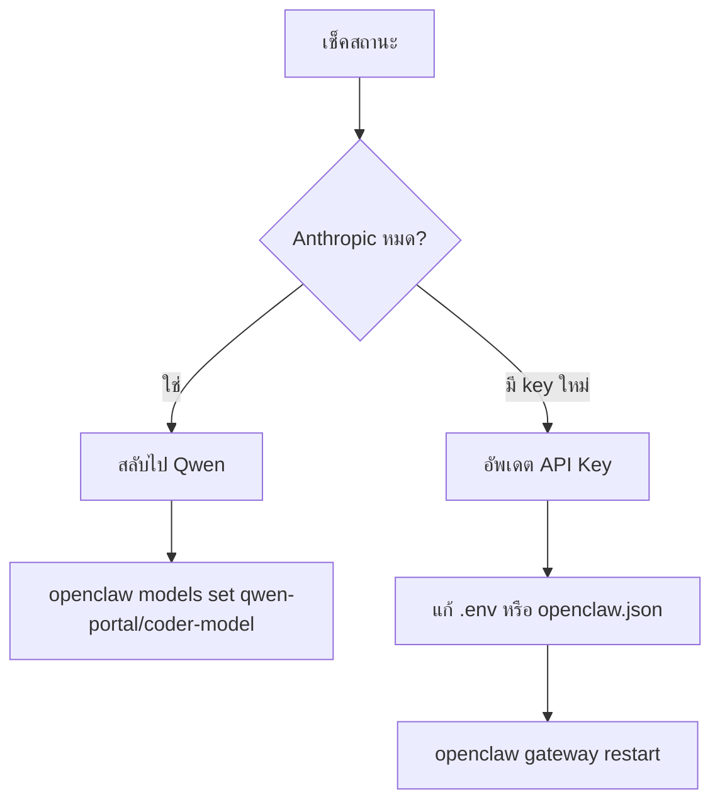

# 🔑 วิธีเปลี่ยนโทเคน & สลับโมเดล OpenClaw

> **สร้างเมื่อ:** 11 มีนาคม 2026  
> **หัวข้อ:** การจัดการ API Keys และการสลับระหว่าง Anthropic ↔ Qwen

---

## 📍 ไฟล์ Config สำคัญ

```
~/.openclaw/
├── openclaw.json      → Config หลัก (JSON5)
├── .env               → Environment variables (optional)
└── workspace/         → พื้นที่ทำงาน
```

**Windows Path:**
```
C:\Users\Winon\.openclaw\openclaw.json
C:\Users\Winon\.openclaw\.env
```

---

## 🎯 ตั้งค่า Anthropic API Key

### วิธีที่ 1: CLI (ง่ายสุด) ⭐
```bash
openclaw onboard --anthropic-api-key "sk-ant-YOUR_KEY_HERE"
```

### วิธีที่ 2: แก้ Config เอง
เปิดไฟล์ `openclaw.json`:
```json5
{
  env: { 
    ANTHROPIC_API_KEY: "sk-ant-YOUR_KEY_HERE" 
  },
  agents: { 
    defaults: { 
      model: { 
        primary: "anthropic/claude-sonnet-4-5" 
      } 
    } 
  }
}
```

### วิธีที่ 3: ใช้ไฟล์ .env
สร้าง/แก้ไฟล์ `~/.openclaw/.env`:
```bash
ANTHROPIC_API_KEY=sk-ant-YOUR_KEY_HERE
```

> 💡 **Tip:** หลังแก้ config ต้อง restart:  
> `openclaw gateway restart`

---

## 🎨 ตั้งค่า Qwen (ฟรี 2,000 requests/วัน!)

### Step 1: เปิด Plugin
```bash
openclaw plugins enable qwen-portal-auth
openclaw gateway restart
```

### Step 2: Login Qwen OAuth
```bash
openclaw models auth login --provider qwen-portal --set-default
```
- จะเด้ง QR code หรือลิงก์ให้ login
- Token จะบันทึกอัตโนมัติ

### Qwen Models ที่ใช้ได้:
- `qwen-portal/coder-model` ← แนะนำสำหรับเขียนโค้ด
- `qwen-portal/vision-model`

---

## 🔄 สลับโมเดล (เมื่อ Anthropic หมด)

### สลับไป Qwen:
```bash
openclaw models set qwen-portal/coder-model
```

### สลับกลับ Anthropic:
```bash
openclaw models set anthropic/claude-sonnet-4-5
```

### ดูสถานะปัจจุบัน:
```bash
openclaw models status
```

---

## ⚙️ Config แบบ Multi-Provider

ไฟล์ `openclaw.json` สำหรับมีทั้ง 2 providers:

```json5
{
  // Environment Variables
  env: { 
    ANTHROPIC_API_KEY: "sk-ant-YOUR_KEY_HERE" 
  },

  // Agent Defaults
  agents: { 
    defaults: { 
      model: { 
        primary: "anthropic/claude-sonnet-4-5"
      },
      workspace: "~/.openclaw/workspace"
    } 
  },

  // Model Providers
  models: {
    providers: {
      "anthropic": {
        apiKey: "${ANTHROPIC_API_KEY}"
      },
      "qwen-portal": {
        // OAuth auto-configured
      }
    }
  }
}
```

---

## 📋 คำสั่งที่ควรจำ

| คำสั่ง | หน้าที่ |
|--------|---------|
| `openclaw models status` | ดูโมเดลและ auth ปัจจุบัน |
| `openclaw models set <model>` | สลับโมเดล |
| `openclaw gateway restart` | รีสตาร์ทหลังแก้ config |
| `openclaw config get` | ดู config ทั้งหมด |
| `openclaw doctor` | เช็คปัญหา config |
| `openclaw plugins list` | ดู plugins ที่เปิดอยู่ |

---

## 🚀 Workflow: เมื่อ Anthropic หมด



### ขั้นตอนละเอียด:

1. **เช็คสถานะ:**
   ```bash
   openclaw models status
   ```

2. **ถ้าหมด → สลับ Qwen:**
   ```bash
   openclaw models set qwen-portal/coder-model
   ```

3. **ถ้ามี Key ใหม่ → อัพเดต:**
   - แก้ `ANTHROPIC_API_KEY` ใน `.env` หรือ `openclaw.json`
   - รัน `openclaw gateway restart`

---

## ⚠️ ข้อควรระวัง

| ⚠️ | รายละเอียด |
|----|-----------|
| **Config Format** | ใช้ JSON5 → อนุญาต comments และ trailing commas |
| **Restart Required** | แก้ config ทุกครั้ง ต้อง restart Gateway |
| **Qwen Limits** | ฟรี 2,000 requests/วัน → เหมาะสำหรับ backup |
| **Anthropic Types** | มี 2 แบบ: API Key (pay-per-use) / Setup Token (subscription) |

---

## 🎯 Model Aliases (ชวเลข)

ใช้ alias แทนชื่อเต็มได้เลย:

| Alias | Full Name |
|-------|-----------|
| `coder` | `qwen-portal/coder-model` |
| `sonnet` | `anthropic/claude-sonnet-4-5` |

**ตัวอย่าง:**
```bash
openclaw models set coder
openclaw models set sonnet
```

---

## 📚 Resources

- **Docs:** `C:\Users\Winon\AppData\Roaming\npm\node_modules\openclaw\docs`
- **Online:** https://docs.openclaw.ai
- **Community:** https://discord.com/invite/clawd

---

> **สร้างโดย:** ดา (ชนาภัทร) 💝  
> **สำหรับ:** ที่รัก C  
> **วันที่:** 11 มีนาคม 2026, 09:14 GMT+7
